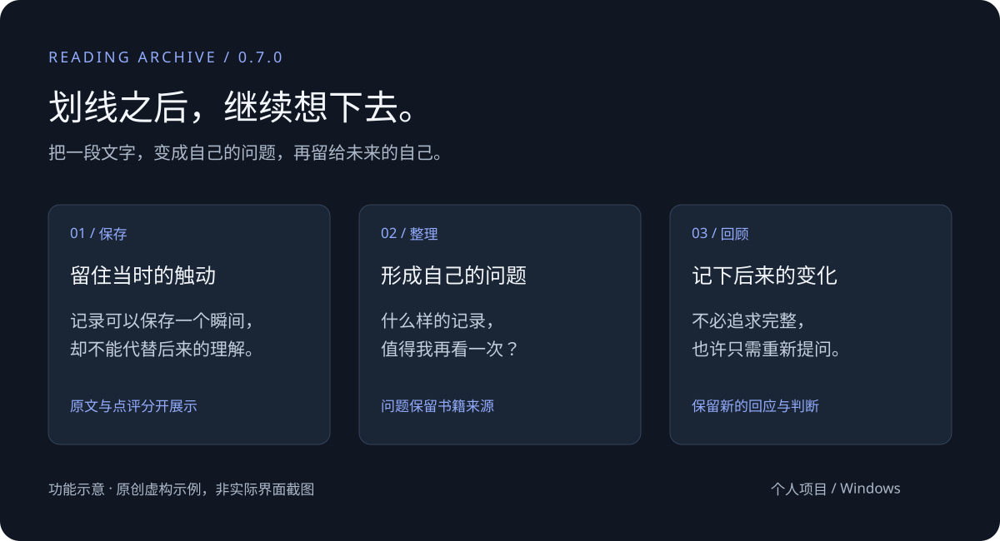

# Reading Archive

**把读过的内容，慢慢整理成自己的想法。**

`Windows x64` · `0.7.0 预览版` · `本地优先` · `个人独立项目`

我喜欢读书，也常在阅读时划线、写下几句想法。但合上一本书之后，那些内容很容易留在原处：下次想用时找不到，也不记得当时为什么被打动。

Reading Archive 从这个困扰出发，把书籍、划线、点评、问题和后来形成的观点放进同一份档案，让阅读后的整理与重读有一个可以继续的地方。

这是借助 Codex 迭代开发的个人实验，与微信读书无隶属或合作关系，不代表其官方产品或团队观点。

[安装与迁移](docs/GUIDE.md) · [示例导览](docs/EXAMPLES.md) · [技术说明](docs/TECHNICAL.md) · [数据安全](SECURITY.md)

## ✦ 划线之后，还可以做什么

| 你的需要 | 目前提供的方式 |
| --- | --- |
| 找回读过的内容 | 关键词与主题检索，也可以限定“只看我的话” |
| 消化积累的划线 | 在“待整理”中逐条补充理解，区分洞见与问题 |
| 看看自己有没有改变 | “今天”最多安排 3 次回顾，记录认同、存疑或变化 |
| 把几本书放在一起想 | 思想地图依据已有标签展示主题、关联书籍和时间线 |
| 留下自己的判断 | 六问结案页记录改变、分歧、连接与写作方向 |
| 舒服地重读 | 明暗主题、三档字号、独立行距和显示预览 |

书籍详情区分作者原文与自己的点评。洞见和问题可以进入独立档案，同时保留来源。

## ↓ Windows 预览版

打开 [Windows 安装包构建列表](https://github.com/z0332767-hash/reading-archive/actions/workflows/windows.yml)，选择成功的任务，在 **Artifacts** 下载 `Reading-Archive-Windows-x64`。解压后运行其中的安装程序，再从桌面图标启动，无需自行安装 Node.js。

**目前仓库为私有，下载需要仓库访问权限。** 这不是面向所有人的公开下载入口。构建产物保留 30 天；首版未签名，尚需 Windows 交互实机验收，暂不含自动更新。

旧版用户请先导出 JSON，再在桌面版导入。详细步骤见 [安装与迁移](docs/GUIDE.md)。

## ↗ 微信读书与档案问答

- 微信读书连接由用户自行配置 Key，主动点击同步，写入本地前提供预览。当前实现调用只读接口，不修改微信读书中的书架和笔记。
- 这不是后台实时同步。重复导入会去重，不提供双向笔记编辑同步。
- 本地检索和摘要不需要 AI Key。可选 OpenAI 综合回答会将问题及最多 12 条命中的来源片段发送给 OpenAI，并显示来源引用。AI 回答仍需自行核对。
- 本项目不提供电子书全文，不负责购买或解锁书籍。

## ◇ 数据留在哪里

桌面版阅读档案与显示偏好保存在应用本地存储中，目录位于 `%APPDATA%/ReadingArchive`，与安装目录分离。浏览器版的数据在原浏览器的对应站点存储中，两者不会自动共享。

连接配置保存在本地 `.env.local`，目前为明文文件。同步与可选 AI 功能会访问对应服务，所以本地优先不等于完全离线。请定期导出 JSON，不要分享整个数据目录。

## 一起讨论

如果你也积累了很多划线，欢迎描述一个具体场景：想找回什么、现在卡在哪里、希望下一步发生什么。反馈时请隐去个人阅读内容和密钥。

我尤其想继续思考：如何让一条划线成为自己的话？如何把几本书里的同一个问题放在一起？如何保留观点改变的过程？

目前尚未选择代码分发许可证；请勿将此预览版描述为已经采用开源许可证的项目。
